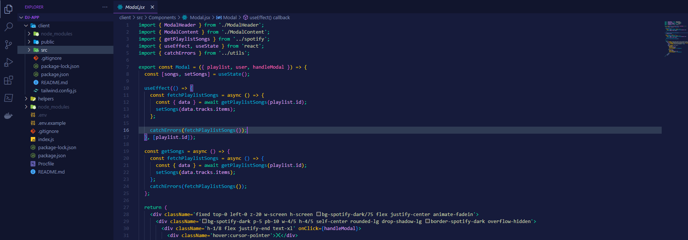

# Void Theme

## Screenshot

## Instructions
1. Open the extensions sidebar on Visual Studio Code
2. Search for Theme
3. Click Install
4. Click Reload to reload your editor
5. Select the Manage Cog (bottom left) > Color Theme ＞ Theme

### Publisher Links
* [Portfolio](https://kennychung.dev)
* [Github](https://www.github.com/supahkenneh)
* [Aux Buddy](https://aux-buddy.herokuapp.com/)
* [Hexle](https://www.supahkenneh.com/hexle)

**Enjoy!**
